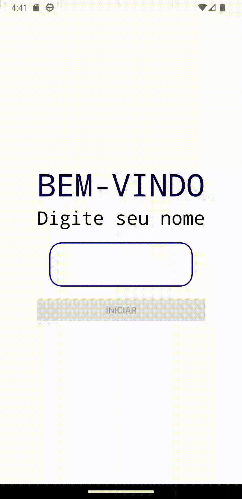
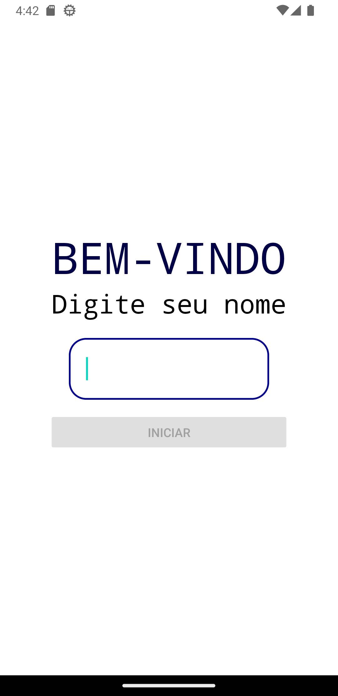
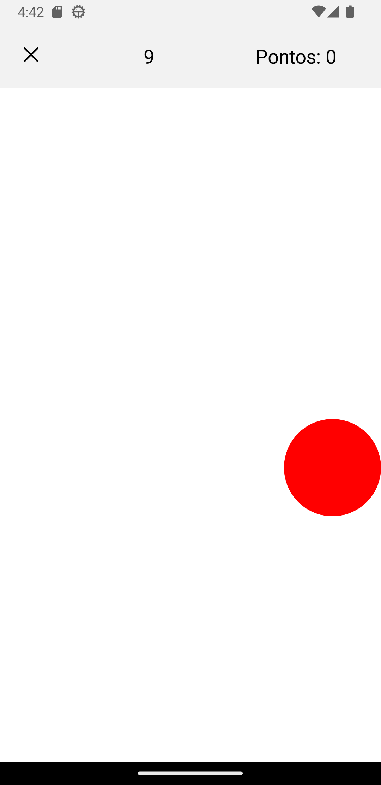
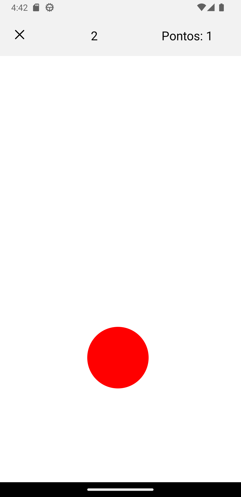
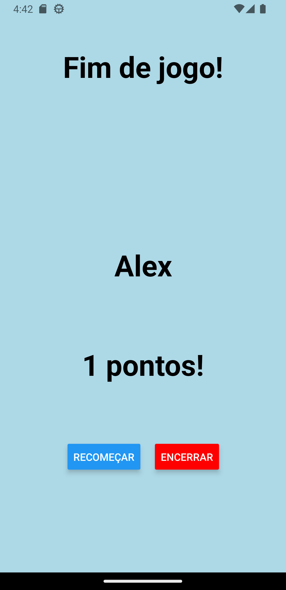

Tecnologia em Análise e Desenvolvimento de Sistemas

Setor de Educação Profissional e Tecnológica - SEPT

Universidade Federal do Paraná - UFPR

# Autor

Thalyson [GitHub](https://github.com/nooneknowws)

# Funcionamento




A aplicação consiste em um jogo no qual o usuário deve tocar o máximo de vezes, durante um período determinado de tempo, em um ícone, em movimento, na tela. 

Sempre ao final de uma partida (15 segundos) a pontuação do usuário deve apresentada. Nesse momento o usuário deve ter opções para jogar novamente ou voltar ao início. 

## Layout






## Detalhes de funcionamento

Na versão final do aplicativo, o ícone deve mudar de posição em duas ocasiões:

1) Ao toque do usuário;
2) A cada intervalo de tempo determinado por uma frequência.

A frequência inicial de mudança automática de posição do ícone deve ser de 1 segundo.

A cada toque do usuário, a frequência de mudança automática deve ser incrementada em 10%. Ou seja, o ícone deve se mover 10% mais rápido a cada toque do usuário.


# Instalação

```
npm install
expo start
```
